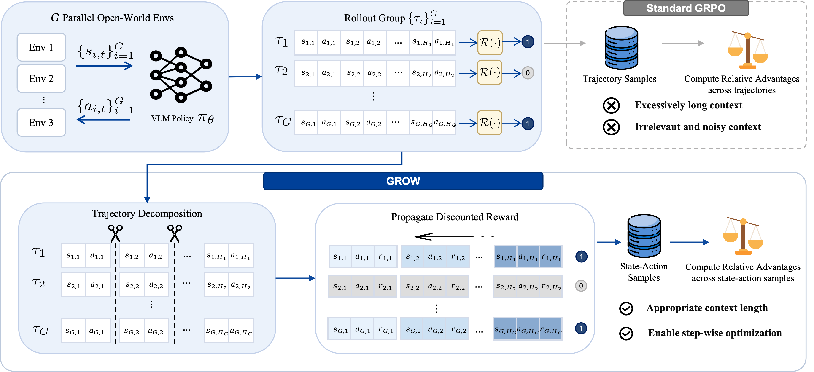

<h1 align="center">GROW</h1>

<p align="center">
  <a href="https://wuxiongbin123.github.io/GROW/"></a>
  <a href="https://huggingface.co/sys555/GROW"></a>
  <a href="https://arxiv.org/abs/2605.20246"></a>
</p>



## News

- **2026.05** Evaluation code and model weights are released.

## Model Weights

The released checkpoint is hosted on Hugging Face:

| Model | Link |
| --- | --- |
| GROW | https://huggingface.co/sys555/GROW |

## Installation

Clone this repository with submodules, then create a Python environment:

```bash
git clone --recurse-submodules https://github.com/wuxiongbin123/GROW.git
cd GROW

conda create -n grow python=3.10 -y
conda activate grow

pip install torch torchvision torchaudio --index-url https://download.pytorch.org/whl/cu124
pip install -e .
```

If you cloned the repository without submodules, initialize OpenHA with:

```bash
git submodule update --init --recursive
```

GROW uses OpenHA for Minecraft environments and task definitions. Install the OpenHA submodule in the same environment:

```bash
conda install --channel=conda-forge openjdk=8 -y
pip install -e third_party/OpenHA
```

By default, evaluation uses `third_party/OpenHA`. To use a different OpenHA checkout, set `OPENHA_ROOT`.

## Evaluation

Run the OpenHA rollout script:

```bash
cd GROW
MODEL_LOCAL_PATH=sys555/GROW \
RECORD_PATH=outputs/openha_eval \
bash scripts/evaluate/openha_rollout.sh
```

The script defaults to the OpenHA `kill_entity:*` task family with 10 rollouts per task. Common overrides:

```bash
TASK="mine_block:*" \
NUM_ROLLOUTS=5 \
MAX_STEPS_NUM=600 \
PARALLEL_WORKERS=4 \
INFERENCE_BATCH_SIZE=8 \
MODEL_LOCAL_PATH=sys555/GROW \
bash scripts/evaluate/openha_rollout.sh
```

Useful environment variables:

| Variable | Default | Description |
| --- | --- | --- |
| `OPENHA_ROOT` | `third_party/OpenHA` | Path to an OpenHA checkout. |
| `MODEL_LOCAL_PATH` | `sys555/GROW` | Local checkpoint path or Hugging Face model id. |
| `RECORD_PATH` | `outputs/openha_eval` | Directory for rollout records. |
| `TASK` | `kill_entity:*` | OpenHA task pattern, for example `mine_block:*`, `craft_item:*`, or a comma-separated list. |
| `NUM_ROLLOUTS` | `10` | Target completed rollouts per task. |
| `PARALLEL_WORKERS` | `4` | Ray workers, usually aligned with available GPUs. |
| `INFERENCE_BATCH_SIZE` | `8` | Batched vLLM inference size per worker. |
| `RESUME_INCOMPLETE_ONLY` | `true` | Skip tasks that already have enough completed rollout records. |
| `RECORD_VIDEO` | `false` | Render rollout videos after completion. |

You can also call the Python entrypoint directly:

```bash
python -m jarvisvla.evaluate.openha_eval \
  --openha-root third_party/OpenHA \
  --checkpoints sys555/GROW \
  --record_path outputs/openha_eval \
  --task "kill_entity:*" \
  --num_rollouts 10 \
  --max_steps_num 600 \
  --parallel-workers 4 \
  --inference-batch-size 8 \
  --no-record-video \
  --use-keyboard
```

## Repository Layout

```text
GROW/
  jarvisvla/evaluate/openha_eval.py       # OpenHA rollout driver
  jarvisvla/evaluate/agent_wrapper.py     # vLLM GROW policy wrapper
  jarvisvla/inference/action_mapping.py   # action-token decoder
  scripts/evaluate/openha_rollout.sh      # launch script
  third_party/OpenHA                       # OpenHA benchmark submodule
  assets/main_picture.png                 # paper overview figure
```

## Acknowledgement

We thank the following projects for their excellent work:

- [OpenHA](https://github.com/CraftJarvis/OpenHA)
- [JarvisVLA](https://github.com/CraftJarvis/JarvisVLA)
- [minerl](https://github.com/minerllabs/minerl)
- [malmo](https://github.com/microsoft/malmo)
- [MineStudio](https://github.com/CraftJarvis/MineStudio/tree/master)
- [ROCKET-1](https://github.com/CraftJarvis/ROCKET-1)
- [SAM2](https://github.com/facebookresearch/sam2)

## Citation

If you find GROW useful, please consider citing our paper:

```bibtex
@article{wu2026grow,
  title   = {GROW: Aligning GRPO with State-Action Modeling for Open-World VLM Agents},
  author  = {Wu, Xiongbin and Luo, Zhihao and Lei, Shanzhe and Zhang, Lechao and
             Wang, Xuhong and Yang, Jie and Zheng, Zhonglong and Zheng, Yuanjie and
             Tan, Xin and Liu, Wei},
  journal = {arXiv preprint arXiv:2605.20246},
  year    = {2026}
}
```
